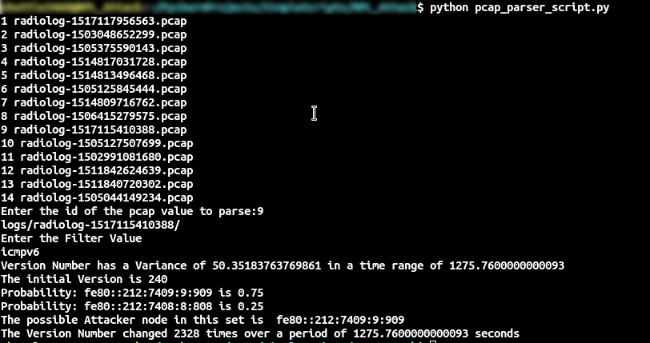

# IOT_Network_Attack

AIM
====================
Find the node causing the Network Attack

Objectives:

    - Obtain data related to packet transmissions basically the pcap File
    
    - Parse the data and get the Version Number, Rank and related info for path data of the packet
    
    - Compute the attacking node and display the possible alternatives

Current Status: **Completed**

[LINK TO PAPER](https://link.springer.com/chapter/10.1007/978-3-030-16660-1_47)

### REQUIREMENTS
    - Linux
    - Python 3
    - Pyshark

### HOW TO RUN
    1. cd to the repository Directory
    2. Do make sure that there are some .pcap files outside the repo directory to analyze
    3. To execute type: python3 pcap_parser_script.py
    4. Select the id of the pcap file from the list of Files Shown [Check the screenshot added below]
    5. In the option to select filter Value
        - udp: Fetches data from all udp packets for packets count and sources
        - icmpv6: Fetches data from all icmpv6 packets for ranks and Version
        - auto: Fetches all icmpv6 data related to DIO, DIS and DAO messages

### OUTPUT

1. For Version Attack
    - Log Files: logs/[radiolog file Name]/version.csv
    - Log Files: logs/[radiolog file Name]/ranks.csv
    - Result: 
        
         
        
    - Collects the frequency of change in Version Number over the time Range
    - The result in the image is the IP Address of the node which affects the Version Number and possibly causing the Version Number Attack

2. For Collecting Packet Data for analyzing Sniffing Attacks
    - Open logs Folder
    - The folders in it refer each radiolog File Parsed
    - RPL_DIO_Meassges.csv, RPL_DIS_Messages.csv are the files that are present in it required for the Sniffing Attacks
