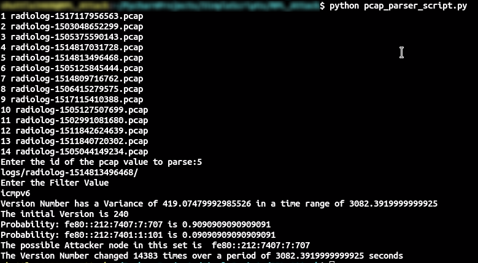

# IOT_Network_Attack
Objective: Detecting the attack  
Current Status: Ongoing

### REQUIREMENTS

- Python 3
- Pyshark

### HOW TO RUN

1. cd to the repository Directory
2. Do make sure that there are some .pcap files outside the repo directory to analyze
3. execute python pcap_parser_script.py
4. Select the id of the pcap file from the list of Files Shown
5. In the command to select filter Value
    - udp: Fetches data from all udp packets for packets count and sources
    - icmpv6: Fetches data from all icmpv6 packets for ranks and Version
    - auto: Fetches all icmpv6 data related to DIO, DIS and DAO messages

### OUTPUT

1. For Version Attack
    - Log Files: logs/version.csv
    - Log Files: logs/ranks.csv
    - Result:  
    - Collects the frequency of change in Version Number over the time Range
    - The result in the image is the IP Address of the node which affects the Version Number

2. For Collecting Packet Data for analyzing Sniffing Attacks
    - logs/RPL_DIO_Messages.csv
    - logs/RPL_DIS_Messages.csv
